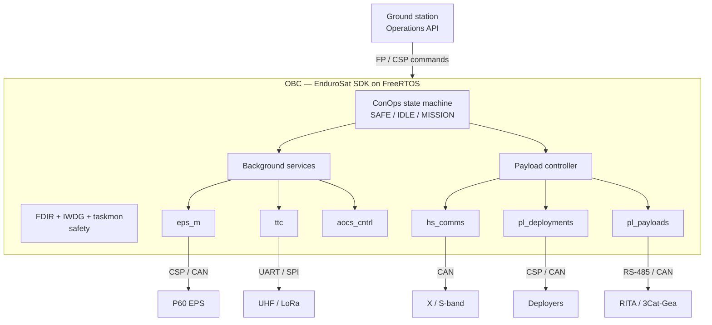

# 1. System Architecture

How the OBC flight software is structured: the task/lifecycle model, the operating modes, and the safety mechanisms.

---

## 1.1 The governing principle

**Tasks are always-on in the RTOS and cycle autonomously; ground commanding is the exception, not the rule.** Every component falls into one of two classes, and the distinction is the core of the architecture.

**Background services** run continuously in every operating mode and are never stopped by the mode state machine:

| Service | Role |
|---|---|
| `eps_m` | Polls the P60 power subsystem over CSP/CAN every 10 s |
| `ttc` | Telemetry, tracking and command (UHF, and LoRa when added) |
| `aocs_cntrl` | Attitude-control proxy, driven by the mode machine; commands an external attitude unit when one is active |

**Payload-controller handlers** are conditional on the operating mode and are started and stopped by the payload controller:

| Handler | Active in |
|---|---|
| `hs_comms` | MISSION mode (X/S-band high-speed downlink) |
| `pl_deployments` | Ground-commanded (deployers) |
| `pl_payloads` | Ground-commanded (the 3Cat-Gea / MB-RITA science hub) |
| `pl_gnss_ro` | (built, not registered — see [§6](06-gnss-ro-payload.md)) |

The `pl_` prefix is reserved for true mission payloads. Power, attitude, and the TT&C radios are platform subsystems and do **not** use it.

**Design rule — platform subsystems are never payload handlers.** EPS is owned by `eps_m` + `eps_ctrl`, attitude by `aocs_cntrl` driven from ConOps, and TT&C by `ttc` — none go through the payload controller, because the developer guides forbid it from owning a platform subsystem (the EPS guide defines no payload handler for power; the attitude guide states the payload controller has no influence on attitude operations). Do not re-introduce EPS or attitude as payload handlers. Communications is split by lifetime for the same reason: `ttc` is the always-on service (UHF, and LoRa when added), while `hs_comms` is the mission-mode high-speed downlink handler. Attitude behaviour that must run at mode entry lives in ConOps user code — for example, ConOps sets the Y-momentum attitude state on MISSION entry (`on_entry_Mission` in `espf/app/conops/gen/conops_sm_config_user.c`).

---

## 1.2 Operating modes (ConOps)

| Mode | Entry condition | Attitude | Payload handlers |
|---|---|---|---|
| `SAFE_NO_CTRL` | battery below critical | all off | emergency-stopped |
| `SAFE_CTRL` | battery below the safe threshold | sun tracking | emergency-stopped |
| `IDLE` | battery recovered, pointing stable | stable | stopped (not started) |
| `MISSION` | all conditions met | nadir pointing | ground-commandable |

The state machine emergency-stops all payload-controller handlers on SAFE entry; background services keep running in every mode. **Not all transitions are permitted:** `SAFE → IDLE` and `IDLE → MISSION` are allowed; `SAFE → MISSION` directly is prohibited — the satellite must pass through IDLE. This guard is part of the safety model.

The safe-battery threshold is held in non-volatile configuration and is ground-adjustable at runtime, not a compile-time constant. The ConOps state machine lives in an auto-generated file; only the user-code regions may be edited, never the generated regions.

> **Naming note.** The mode enum values are `SAFE_NO_CTRL` / `SAFE_CTRL`; on the trace channel and the Operations API the same state is reported as the string `STATE_SAFE_NO_CONTROL`. These are the same state in two forms. A fresh boot with no prior commands correctly reports the `SAFE_NO_CONTROL` state.

---

## 1.3 Safety mechanisms

**FDIR (fault detection, isolation, recovery).** Each fault is owned by exactly one agent. A major-level fault automatically triggers a transition to SAFE. The battery-voltage fault is owned by `eps_ctrl`, never by `eps_m` — though `eps_m` does own one fault of its own, a P60-communication-failure fault it raises when the Dock stops answering on the bus (see [§2](02-power-subsystem.md)).

> **Known gap (safety).** On 3Cat-8 as built, that low-battery fault is *inert*: the check reads a DataCache entry the active `eps_m` driver never writes, so its guard is never satisfied and the safe-mode transition never fires. The ownership is correct; the mechanism is not wired to the active driver's telemetry. Full detail and a data-flow diagram are in [§8](08-system-findings.md).

**Watchdog and task supervision.** The independent watchdog (IWDG, 30 s, frozen in debug) is refreshed unconditionally by the `taskmon` supervisor, which runs at real-time priority on a 100 ms loop — so a blocked application task cannot starve the hardware watchdog. `taskmon` also runs a separate software-reset path (a ten-minute check window) for the tasks it monitors.

> **Known gap (safety).** The project's own services each call `drv_iwdg_refresh()` directly but are **not** registered with `taskmon`, so a permanent hang in one of them is neither detected nor recovered — the direct refresh gives a false impression of coverage. Detail in [§8](08-system-findings.md).

**DataCache.** A passive store: subsystems write to it, it does not poll. Until real hardware writes data, entries read as uninitialised. Never assume a DataCache entry holds real data until its status reads OK.

---

## 1.4 Where it lives

The mode machine is in the auto-generated ConOps configuration (`espf/app/conops/`); the task/lifecycle wiring is in `main.c` and the `sys_instancer`; the components are under `espf/core/services/` (services) and `espf/arch/.../drivers/` (drivers). Component-by-component detail is in the sections that follow.

## 1.5 Deferred by design

Two capabilities are deferred by design — planned, with a clear intended home, but not yet built:

- **Health-monitoring (`hk`) service.** A dedicated health-aggregation service was deferred until at least two subsystems produce real DataCache telemetry — until then it would have nothing meaningful to aggregate. In the current design, health data flows through DataCache and the telemetry/beacon path directly; the `hk` service is the intended future home for cross-subsystem health logic.
- **High-speed bulk downlink (X/S-band).** The plan is to reuse the EnduroSat custom file-transfer protocol (`es-tftp`) over the science-data path for large payload data, deferred to the objective that integrates it; it is not the standard IP TFTP daemon (which is not compiled in this build). This is the path referenced from [RITA result retrieval](05-rita-payload.md).
