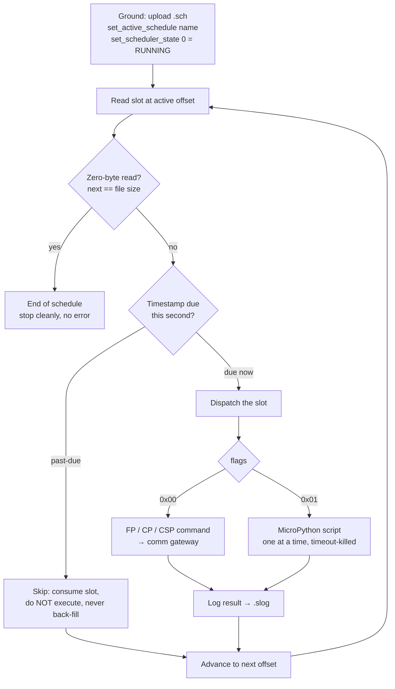

# 3. Onboard Scheduler

The autonomous time-tagged sequencing the mission needs (a RITA session is a sequence of dependent steps). The OBC uses the EnduroSat Onboard Scheduler Service (OSS) rather than a custom scheduler — the SDK already provides flight-grade time-tagged dispatch, so the work is on the ground-side tooling to build and run schedules, not on reimplementing the scheduler. Execution is bench-verified (§3.4).

**Status: HW** (single- and multi-slot execution bench-verified).
**Code:** OSS is SDK-provided; the ground builder is `other/scripts/sch_builder/` (and `3cat8-gs/`).

---

## 3.1 What it does

The OSS executes time-tagged entries from an uploaded `.sch` file at one-second precision. A scheduled slot can dispatch a Function-Protocol command, a CP command, a CSP command (node + port + priority + timeout), or a MicroPython script by name. Output is logged to a `.slog` file. Because it can dispatch CSP commands directly, once CSP-over-CAN was proven on the power subsystem, timed CSP sequences can be scheduled to any CAN device — including timed P60 power sequencing.

The dispatch loop — armed once from the ground, then walking the slot chain one second at a time until end-of-file (firmware `onboard_sched.c`, the `do { … } while (next == entry_res)` loop):

## 3.2 The `.sch` binary format (verified against firmware)

- **12-byte file header:** `"SCHED\0"` + format version (2 bytes) + next-free-offset (uint32 LE).
- **Per slot:** a 4-byte `next` field (file offset of the next slot) + an 11-byte entry (`timestamp` uint32 LE UTC-seconds, `seq_id` uint32 LE, `flags` uint8 `0x00`=command/`0x01`=script, `cmd_size` uint16 LE) + the command/script buffer + a 2-byte CRC16.
- **CRC16-CCITT (FALSE)** (poly `0x1021`, init `0xFFFF`, no reflection, no final XOR), **one per slot**, covering the entry and buffer but **excluding** the `next` field (which can be rewritten on insertion). There is no file-level CRC.
- **End of file:** the last slot's `next` field is the total file size (`eof_offset`), producing a zero-byte read the firmware treats as end-of-schedule. It is **never** `0xFFFFFFFF` — that would trigger a 4 GB seek and a spurious error. The builder handles this correctly.

The format above was pinned by reading it against the firmware's own parser, so the ground builder (`sch_builder`) produces byte-compatible files; its CRC uses the same CCITT-FALSE parameters as the firmware and was cross-checked against the firmware's CRC table, so ground and flight agree by construction rather than by luck.

## 3.3 Operational specifics (verified against firmware)

- The scheduler is started with `set_scheduler_state(0)` — counterintuitively, **0 = RUNNING**, 1 = stop. (The four stock ground scripts only stop/query/load; none start it.)
- **Past-due slots are silently skipped** — the OSS does not back-fill. A slot whose timestamp has already passed when the scheduler scans it is consumed without executing. Always set a slot timestamp comfortably in the future from the moment the scheduler is started (not from when the file was built); the ground tool refreshes timestamps and re-uploads if the upload ran long.
- **MicroPython scripts must be pre-compiled.** The on-board compiler is disabled, so a `.py` source is rejected at runtime; compile to `.mpy` on the ground (`mpy-cross`) and name the *module* without extension in the slot. The `.sch` file itself must keep its extension — the loader rejects non-`.sch` names. A per-script timeout is carried in the slot and enforced by the runaway-script protection.

## 3.4 Verification

**Single-slot:** bench-verified 2026-06-30 — a scheduled script fired and the released slot appeared in the `.slog`.

**Multi-slot chaining:** bench-verified **2026-07-21**. A two-slot schedule (a CP command at T+120 s, then a MicroPython script at T+150 s) was run with the ground tool: both slots fired (both sequence identifiers present in the `.slog`), the scheduler followed the `next` pointer from the first slot to the second, and after the second slot it stopped cleanly on a zero-byte read with no spurious error. This proved the three properties a single slot cannot: pointer traversal, clean end-of-file termination, and correct refresh of a past-due timestamp.

> **Two honest caveats.** The multi-slot run used the 2026-06-30 diagnostic image (the same firmware line the single-slot test passed on), not the final build. Since the onboard scheduler is unchanged vendor SDK code between the two builds and the committed HEAD boots clean ([§9.2](09-development.md)), the result holds on the delivered firmware — a repeat run would confirm rather than extend it. Its evidence (the schedule file and decoded log) is preserved in the handoff materials but was not committed to the repository.
