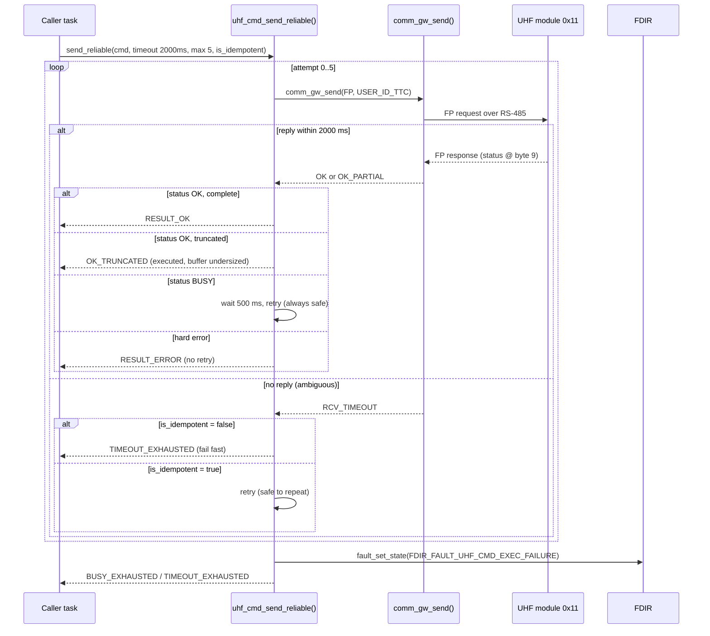

# 4. Communications — `ttc`

Telemetry, tracking and command. The UHF command paths need **no new OBC firmware**; on top of that, `ttc` carries a reliable OBC-to-UHF command-dispatch primitive.

**Status:** UHF paths resolved (**code-verified**, never observed on RF); reliable dispatch **IMPL** (build-verified, boots, no caller yet); LoRa not started.
**Code:** `espf/core/services/ttc/` (`ttc.c`, `uhf_cmd.c`).

---

## 4.1 The UHF paths need no new firmware

- **Downlink** is handled end to end by the SDK **beacons service**: DataCache → beacons service → ESPS MAC → UHF module → RF. `ttc` is not involved.
- **Uplink** dispatches through the **standard MAC path**. A ground command relayed by the UHF module (which sits on the ESPS bus like any other device) reaches the same dispatch logic as every other bus device; dispatch is source-address-agnostic, so no UHF-specific code is needed.

`ttc` therefore carries no UHF-specific transmit or receive code — neither direction needs it. **LoRa integration is the one item that remains** under communications.

## 4.2 Reliable OBC-to-UHF command dispatch

Separately from ground commanding, the OBC issues a few *local* commands to the UHF module over the Function-Protocol link (read counters, read received-packet count, set a beacon to send). The existing callers hand-rolled their response handling with no retry, while the codebase already had a reusable blocking reliable-call primitive — the communication gateway, `comm_gw_send()` — that no UHF caller used. `uhf_cmd_send_reliable()` closes that gap: a bounded-retry wrapper around `comm_gw_send()`, placed in `ttc` (project-owned code) rather than in `comm_gw` (untouched vendor code).

**Retry policy:** 2000 ms response timeout, 500 ms busy backoff, at most 5 attempts (~12.5 s worst case, inside the gateway's own 30 s per-user lock ceiling).

The central design idea is that **busy and timeout are not the same failure**:

Four decisions, all settled and build-verified in `uhf_cmd.c`:

- **Idempotency (the timeout branch).** `BUSY` means the module explicitly did *not* execute — always safe to retry. A timeout is ambiguous, so timeout-retry happens only when the caller passes `is_idempotent = true`; it is conservative by default, so forgetting yields the safe behaviour. The two read commands pass `true`; the beacon-set command passes `false`.
- **Watchdog margin.** The ~12.5 s worst case cannot reset the OBC: `taskmon` refreshes the hardware watchdog every 100 ms at real-time priority, its software-reset window is ten minutes, and shipped vendor code already passes a 15 s timeout to the same gateway call from a supervised task. (This safety depends on the caller being supervised or having enough margin.)
- **Address.** The UHF ESPS address (`0x11`) is fixed by the bus design, so it is hardcoded deliberately — deterministic, no read-failure path.
- **Truncated response.** A partial-OK result is handled on the success path (the status byte survives truncation) and returned distinctly (`OK_TRUNCATED`) so the caller learns its buffer was undersized rather than parsing an incomplete buffer as complete.

**Developer-guide alignment:** the component structure follows the "new component" pattern, there is no layering violation (both `ttc` and the gateway are Services), and the gateway is used for exactly its documented purpose. It is not a new SDK component — correctly, since it adds no new Function-Protocol commands.

## 4.3 Open items

- **The reused FDIR fault's configured response is unverified for a new caller.** The primitive reuses the UHF fault, which is configured elsewhere for a low-stakes, self-healing meaning. Confirm that response suits a consequential caller — or define a separate fault — before wiring one.
- **No caller exists yet.** The primitive is built, linked, and boots, but nothing calls it. The natural first caller (the comm-loss watchdog) uses a different, fire-and-forget call pattern and issues two requests per 10 s loop, so adopting the primitive there needs its own feasibility check against that loop's timing.

> **Verification status.** There is no evidence anywhere that a UHF beacon has ever been transmitted or received on real hardware. The paths are code-verified and would transmit if powered with a module attached, but none of it has been observed working — keep that distinction explicit.

## 4.4 High-speed downlink — `hs_comms`

The mission-phase X/S-band high-speed downlink handler — the mission-mode counterpart to the always-on `ttc` service (communications is split by lifetime; see [§1](01-system-architecture.md)).

**Status: SKEL** — the handler, its FDIR fault ownership, and the watchdog refresh are in place; the X/S-band drivers are TODO.
**Code:** `espf/core/services/hs_comms/`.

It is a `payload_ctrl` handler (ID 1), active only in MISSION mode, and it owns `FDIR_FAULT_S_X_BAND_CMD_EXEC_FAILURE`. One integration fact a successor needs: on 3Cat-8 the S/X-band transceivers hang off the **MB-RITA CAN bus**, not a locally-connected module, so the EnduroSat *native* S/X-band handler (`sxband_pl_ctrl_if`) is **inert** on this satellite — the correct path is `hs_comms` commanding the transceivers over CSP/CAN, the same transport proven on the power subsystem ([§2](02-power-subsystem.md)). The remaining work is the X/S-band driver itself.
