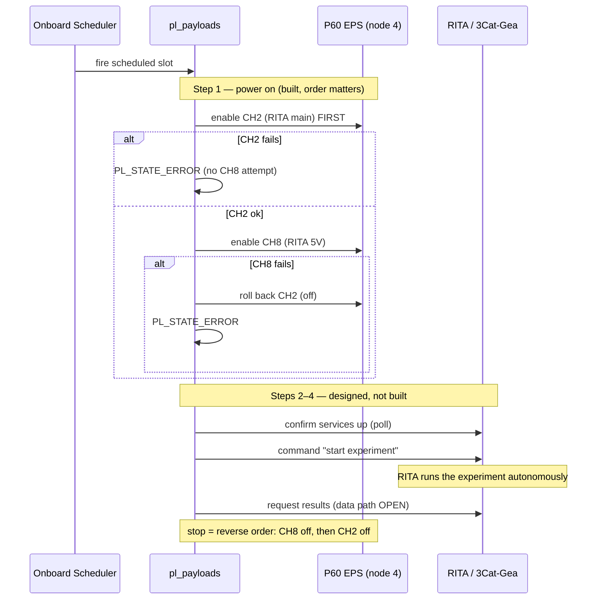

# 5. Mission Payload Handlers

The two ground-commanded mission-payload handlers, both emergency-stopped in SAFE: the **RITA imaging payload** (`pl_payloads`, §5.1) and the **deployment sequencer** (`pl_deployments`, §5.2).

## 5.1 RITA imaging (`pl_payloads`)

Orchestration of the RITA (3Cat-Gea / MB-RITA) polarimetric-imaging payload. The design insight is that **RITA is autonomous** — the OBC powers and supervises it, it does not drive the imaging.

**Status: IMPL** (power sequence built and address-confirmed); activation and retrieval remain.
**Code:** `espf/core/services/pl_payloads/`.

---

### The model: power-and-supervise, not drive

RITA runs its polarimetric experiment internally (rotor motion, capture, processing) on its own hardware. The OBC's role is a four-step sequence: **power** the relevant EPS channels, **confirm** RITA's services are up, **command** the experiment start, and **retrieve** results. The onboard scheduler orders the dependent steps (power before talk; RITA before downlink) — it does not drive the experiment loop. This follows the lab principle of pushing any task that can live in the subsystem down into the subsystem, since OBC load is a constraint.



### The power sequence (built)

`pl_payloads` implements the power step through the platform channel-control API (`eps_ctrl_set_channel_output()`), never touching the P60 directly — a payload handler drives channels through the platform layer, not the bus, keeping the two concerns separate. The ordering is the safety property: on start it enables the main rail **CH2** (`CH3CAT8_EPS_CH_RITA_MAIN`) first — on failure it goes to the error state and makes no CH8 attempt — then the sub-rail **CH8** (`CH3CAT8_EPS_CH_RITA_5V`, the camera USB and rotor); if CH8 fails, it rolls CH2 back and errors. On stop it powers down in reverse (CH8 then CH2), attempting both even if the first fails, so stop always reaches the stopped state. The hub must be powered before its peripherals and de-powered after them.

> **Power caveat.** This code commands real P60 channels. The write address is confirmed on the live Dock, but the CH2/CH8 power-on-boot defaults must be verified before any first flight use ([§7](07-interfaces.md)). A benign boot trace exists: at boot the stop routine logs a channel-off "failure" because the safe-mode transition fires before the power controller is warm — the channels are already off, so there is no hardware effect. Do not alarm on it.

### What remains

Steps 2–4 land at a single insertion point in the handler (the "started" state): the CSP activation command to the 3Cat-Gea main node, service confirmation, experiment start, and result retrieval. Two cautions for whoever builds it: the OBC-side payload-info query returns the OBC task state only, not a liveness check of the 3Cat-Gea, so a real confirmation step is needed; and the 3Cat-Gea main node's CSP address is a placeholder in the current code.

**The data-retrieval path is open** and depends on the RITA command/data specification: small status telemetry fits the normal channel, while large image/spectral data likely needs bulk file transfer over the EnduroSat custom file-transfer protocol (a separate, deferred objective), not standard IP TFTP.

---

## 5.2 Deployment sequencer (`pl_deployments`)

The payload handler that deploys the antenna and structure elements after launch. The sequence logic is built; it is blocked on the deployer bus addresses.

**Status: SKEL** — the sequence state machine is implemented and the vtable is complete, but the deployer CSP node addresses are placeholders (`0`), so the actual deploy commands cannot reach a device until the addresses are assigned.
**Code:** `espf/core/services/pl_deployments/`.

**How it works.** On start, the handler runs a fixed sequence through an internal state machine:

```
IDLE → WAITING_POSTLAUNCH → SP+Monopoles (#1) → FZPA (#2) → CuPID (#3) → COMPLETE
                                        (any failure → ERROR)
```

It first waits out the post-launch inhibit hold, then fires each deployer in turn via `trigger_deployment(csp_node, name)`, separated by an inter-deploy delay (`PL_DEPLOY_INTER_DEPLOY_DELAY_MS = 5000 ms`) so the deploys do not overlap on the shared 12 V rail (EPS CH6). The order is fixed: SP + Monopoles, then the Fresnel Zone Plate Antenna, then the CuPID deployer.

**Flight-critical — the post-launch inhibit hold.** The hold is `PL_DEPLOY_MIN_POSTLAUNCH_DELAY_MS`, currently `0U` for ground testing — and at zero the wait is **skipped entirely** (the code guards the delay with `if (delay > 0)`). The in-source flight target is **1,800,000 ms (30 minutes)** (`TODO: set to 1800000U for flight`). This value must be confirmed against the launch-provider mandate and set before any flight build. It is a safety and regulatory requirement, not an implementation detail — see [§8](08-system-findings.md).

**Two things block or complicate it:**

- **Blocked on the deployer CSP node addresses.** They are `0` placeholders; `trigger_deployment()` cannot address a real node until they are assigned (a systems input, not a code fix).
- **The long inhibit hold interacts with task supervision.** Because the deployment task sleeps through the (up-to-30-minute) hold, it is the specific reason a naive `taskmon` registration would reset the OBC mid-hold — the trap described in [§8](08-system-findings.md). Any supervision fix must handle this long-sleeping task explicitly.
