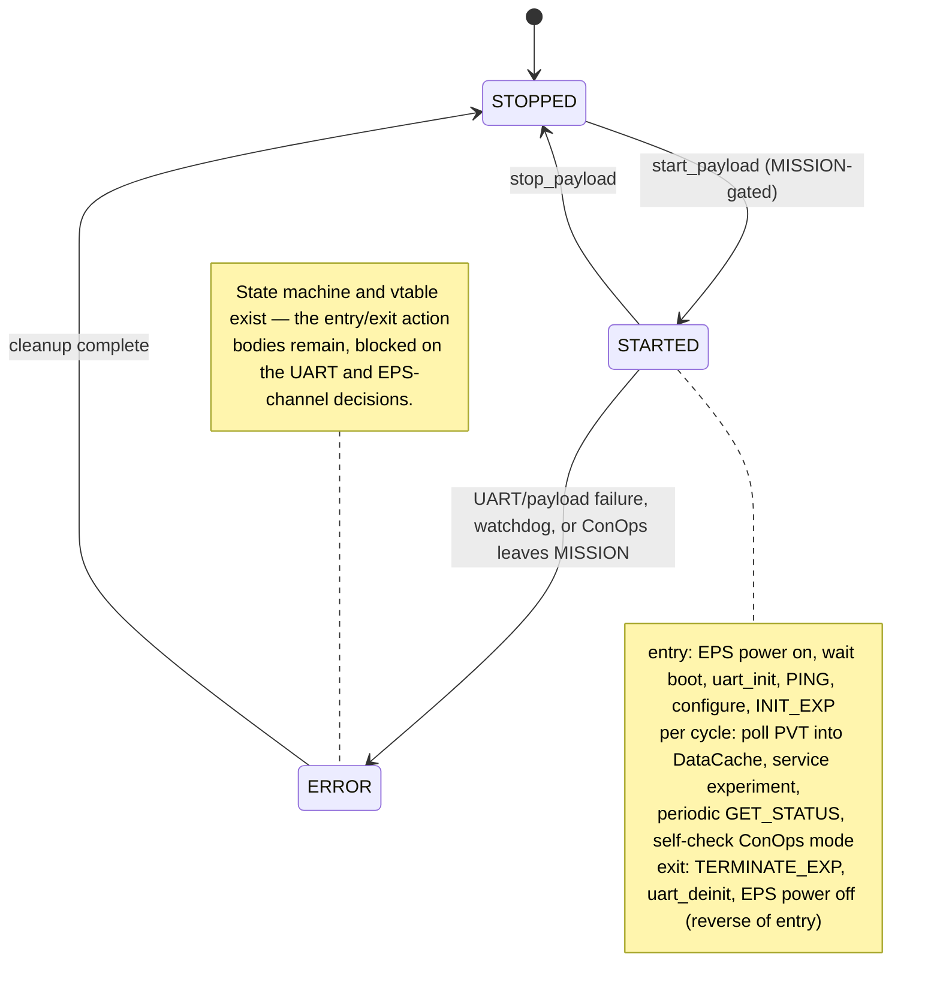

# 6. GNSS-R/RO Payload — `pl_gnss_ro`

Integration of the GNSS reflectometry / radio-occultation science payload on the OBC side. The command and protocol layers are built; the transport, registration, and data path are designed and blocked on specific decisions.

**Status: SKEL** — command + protocol layers built and build-verified; the handler is compiled into the build but **not registered** with the payload controller, so its task never runs.
**Code:** `espf/core/services/pl_gnss_ro/`.

---

## 6.1 The one physical fact that shapes everything

The payload is an autonomous subsystem: its own STM32L476 running FreeRTOS, its own microSD, and two SkyTraq receivers — **B16** (navigation: position, velocity, time) and **B17** (science: reflectometry and radio occultation). **The OBC never talks to B16 or B17 directly.** Both are internal to the payload and speak only to the payload's STM32. The OBC's single conversation partner is that STM32, over **one UART link**. Every choice below follows from this: one UART, one partner, a relay behind it.

## 6.2 Two command layers (keep them distinct)

- **Layer 1 — Ground → OBC:** EnduroSat's Function Protocol via the `payload_ctrl` service ("start / stop / query this payload"). Fully provided by the SDK; it terminates the instant the handler's `start()` is entered.
- **Layer 2 — OBC → payload STM32:** a direct UART link. Once Layer 1 delivers "start," the handler sends its own commands down to the payload to run experiments, request PVT, and retrieve data. This layer is **not** in the EnduroSat catalogue — it is custom to this payload, and it is the part that had to be designed.

## 6.3 What is built

Two of the four OBC-side layers, build-verified:

- **Command layer** (`pl_gnss_ro_cmd.{h,c}`) — a 14-command API over a tagged-union command type, with constructors, covering the B16, B17, and file-handling command families.
- **Protocol layer** (`pl_gnss_ro_proto.{h,c}`) — the 9-byte framing, encode/decode, and CRC16 (reusing the scheduler's CRC).

The component is added to the build (`add_subdirectory(pl_gnss_ro)` + `ESPF_CORE_LIBS` in `espf/core/services/CMakeLists.txt`) but is **not registered** in the payload-controller config (`espf/config/payload_ctrl/payload_ctrl_cfg.c`), so its task is never spawned; with no caller, the linker garbage-collects the code and it adds zero flash/RAM. The handler skeleton is complete and correct — a full vtable, a correct state machine, the watchdog refreshed, and the three unknowns fenced behind named placeholders — built so implementation can proceed without restructuring once the decisions land.



## 6.4 What is not built, and what unblocks each

| Piece | Blocked on | Lands as |
|---|---|---|
| UART transport | the UART peripheral assignment (COL-01, [§7](07-interfaces.md)) | the transport, following the OEM719 driver pattern (§6.6) |
| Handler power control | the EPS channel for the payload | two `eps_ctrl_set_channel_output()` calls |
| Registration as a handler | the architecture fork (§6.5) | vtable registration + mode gating |
| DataCache PVT entry | nothing — buildable now | a new FIDL entry + code-generator regeneration |

The DataCache entry: the existing GNSS DataCache entries are hard-locked to the NovAtel OEM719 wire format and cannot be reused; a new entry (e.g. `DC_DID_GNSS_RO_PVT_DATA`) must be added the sanctioned way (edit the FIDL, regenerate on build; never hand-edit the generated cache). Once in DataCache, the PVT is automatically telemeterable. **Design decision left open:** the entry's `Status_timeout` (the staleness threshold after which DataCache marks the value `TOUT`) should be set to match the intended PVT polling interval rather than left at the 5-second default by omission — the default would silently mislabel PVT as stale or fresh if the poll rate differs. Propose the value together with the poll interval when the handler is built.

## 6.5 The architecture decision (upstream of everything)

**The question:** the B16 position data is intended for the OBC's attitude/orbit determination. Does that make GNSS-R/RO partly a *continuous platform-navigation service* (a background driver, like the OEM719 GNSS driver) rather than a purely commanded science payload?

**What the source shows:** a payload handler is architecturally forbidden by the developer guide from feeding the attitude system ("The Payload Controller has no direct dependency or influence on AOCS operations"); the real GNSS-to-attitude path is a background-driver pattern (a position callback into DataCache, an attitude-sync callback). That path's code **is compiled** — the second-generation attitude computer's build flag is enabled in the committed configuration — so whether the consumer is *active* is a runtime module-activation question, and whether the flight design activates an attitude system that consumes GNSS position is itself the open flight-attitude decision.

**Recommendation:** build `pl_gnss_ro` as a **single payload handler** now (correct for the experiment/command side regardless), structured so PVT ingestion into the new DataCache entry is a clean, addable capability. Onward delivery of PVT to an attitude system is conditional on the flight-attitude decision and, if it happens, follows the background-driver pattern — not the handler. Both possible architectures reuse the same built command/protocol/transport code; only registration and mode-gating differ. Since the physical link is one UART to one STM32, a single handler that both commands experiments and polls PVT is the natural structure.

## 6.6 Transport — reuse the OEM719 driver pattern

There is no shared UART helper in the SDK; each driver re-implements the pattern. The OEM719 positioning driver solves the identical problem (raw UART, variable-length data): `HAL_UARTEx_ReceiveToIdle_DMA` for receive (idle-line detection suits variable-length output), an `osMessageQueue` between the receive callback and the consumer, a blocking `..._rx(timeout)` API, and a **custom `MspInitCallback`** set directly on the UART handle (HAL checks it before the global weak MSP, which avoids an ungated global UART4 branch — a known trap). IRQ forwarding is added in the hook dispatcher for the chosen UART/DMA stream. One note: the placeholder `osDelay` in the handler task must be removed once real receive is wired, or it doubles the per-cycle latency.

## 6.7 The OBC↔payload wire protocol (Layer 2)

This is a **designed contract** — a draft proposal, **not yet agreed** — to be signed off and then implemented independently on each side. It is not read off the payload: the payload firmware has no wire format defined either, so the two sides must agree this one.

**Frame (both directions), 9-byte overhead:**

```
+------+------+-------------+------+-----+------+-----...-----+-------------+
| SYNC0| SYNC1|   LEN (u16) |MSG_ID| SEQ |FLAGS |   PAYLOAD    |  CRC16 (u16)|
+------+------+-------------+------+-----+------+-----...-----+-------------+
 0xA5   0x5A   LE, = N (≤512)                   N bytes        LE, CCITT-FALSE
```

`CRC16` is CCITT-FALSE over everything after `SYNC1` — the same algorithm the OBC scheduler uses. `FLAGS`: bit 0 `RESPONSE`, bit 1 `ERROR` (payload is a 1-byte error code), bit 2 `MORE` (fragmented file transfer). Design rules: explicit framing (never raw struct copies — the payload structs are unpacked and one uses `size_t`, whose width differs across the toolchains); little-endian, explicitly sized fields; message IDs reuse the payload's own numbering; a `SEQ` a response must echo (so a late reply to attempt *N* is never taken for attempt *N+1*). Receiver behaviour: scan for `A5 5A`, discard-and-resync on CRC failure, answer an unknown `MSG_ID` with `ERR_UNKNOWN_MSG` rather than silence.

**Message identifiers** (`0x03`–`0x25` taken from the payload's own task-command enums; `0x00` reserved):

| ID | Name | ID | Name |
|---|---|---|---|
| `0x01` | `PING` (new) | `0x15` | `B17_CONFIGURE` |
| `0x03` | `B16_GET_PVT` | `0x21` | `FILE_LIST` |
| `0x04` | `B16_GET_STATUS` | `0x22` | `FILE_LIST_BETWEEN` |
| `0x05` | `B16_CONFIGURE` | `0x23` | `FILE_SEND` |
| `0x11` | `B17_INIT_EXP` | `0x24` | `FILE_DELETE` |
| `0x12` | `B17_PERFORM_EXP` | `0x25` | `FILE_FREE_SPACE` |
| `0x14` | `B17_GET_STATUS` | `0x31` | `SET_ANTENNA_SWITCH` (new) |

**Key encodings.** `PING` → 1-byte `protocol_version`. `B16_GET_PVT` → 26 bytes: UTC (year u16, month/day/hour/minute/second u8, millisecond u16), then `latitude_1e7`/`longitude_1e7`/`altitude_mm` (i32, degrees × 10⁷ ≈ 1 cm), `fix_type` u8, `num_satellites` u8, `hdop_1e2` u16. (This layout is *designed*, not mirrored: the payload's own PVT uses `int16` degrees meant only for a receiver cold-restart — far too coarse for the OBC.) `CONFIGURE` → an 8-byte prefix (an `action_flags` bit-per-field, then power/reset/output/RTK fields) plus an optional raw SkyTraq command; note the `RTK_function` enum reuses values across modes, so both sides must interpret it strictly in the context of `rtk_mode`. `INIT_EXP` → 4-byte `duration_ms`; file operations use length-prefixed strings and fragment `FILE_SEND` with an explicit per-fragment offset.

**Error codes** (1-byte payload when `ERROR` set): `ERR_UNKNOWN_MSG`, `ERR_INVALID_PARAM`, `ERR_WRONG_LENGTH`, `ERR_BUSY`, `ERR_RECEIVER_FAULT`, `ERR_SD_FAULT`, `ERR_NOT_FOUND`, `ERR_NOT_SUPPORTED`. **`ERR_BUSY` is the only retryable code** — the same busy-vs-failed distinction the UHF link uses ([§4](04-communications.md)).

**OBC-side timing/retry:** 2000 ms timeout; up to 3 retries on `ERR_BUSY` (500 ms apart); **0 timeout retries by default** (only read-only commands may be retried on timeout); `SEQ` matching mandatory. The payload is asked to service one command at a time and always respond, including on error.

## 6.8 Two physical-layer prerequisites (payload side)

Found by reading the payload firmware; both are prerequisites, not protocol questions:

1. **The payload transmits debug output on the OBC UART** (`debug_printf` on the same UART as the link). No framing survives an unrelated text stream — debug output must move to another UART or be compiled out. *Blocking.*
2. **The UART alias macros contradict their own wiring comments** — the macro names say one UART, the comments another. The physical wiring must be confirmed before either side commits to a peripheral. *Blocking.*
