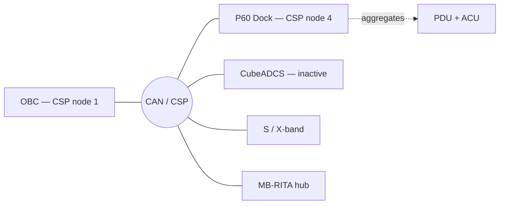

# 7. Interfaces

The single reference for every hardware-interface fact: buses, CSP nodes, UART allocation, EPS channels, register addresses, and module activation. If another section states one of these, it links here. Tags: **HW** verified on hardware · **CODE** verified in firmware/source · **DOC** from vendor documentation, unconfirmed · **OPEN** unresolved. Never command hardware against a `DOC` or `OPEN` address without confirming it first — several addresses from the 2017 manual were wrong on the live 2019 firmware.

---

## 7.1 Bus topology (CAN / CSP)

CAN is on OBC pins H1:1 (CANL) / H1:3 (CANH), carrying the CubeSat Space Protocol to the P60 EPS, CubeADCS, S/X-band, and the MB-RITA hub. **HW**

The OBC is CSP node 1; the P60 Dock is node 4. The Dock is a single node that aggregates the PDU and ACU internally (`power` GOSH client reaches PDU channels via the Dock on CSP port 10). Node 3 does not exist on this bus. **HW**

| CSP node | Device | Tag |
|---|---|---|
| 1 | OBC itself — placeholder identity, must NOT be targeted | HW |
| 4 | P60 Dock (the EPS) — single node, aggregates PDU + ACU | HW |
| 3 | absent — does not exist on the bus | HW |
| deployer nodes | FZPA, CuPID, SP+Monopoles — addresses currently 0 | OPEN |

The CAN bus requires 2×120 Ω termination (60 Ω) in the flight harness; it is not built into the OBC or the Dock. **HW**

The bus runs at **1000 kbps** — the P60 default, set via its `can_speed` parameter — and the OBC's CSP/CAN driver must match it. A mismatched rate fails *silently*: no error is raised and no data arrives, so a rate mismatch presents exactly like a dead device. **CODE** (`eps_m.c`)

## 7.2 UART allocation

Verified against the OBC Type I User Manual v4.18 Table 2, the ESPS driver config, and the build configuration.

| Interface | Pins | Used by | Tag |
|---|---|---|---|
| UART4 (RS-485) | H1:17, H1:18 | RITA / MB-RITA (PAYLOAD 2 RS-485), DE-gated via PF13 | CODE |
| UART4 (TTL) | H1:19, H1:20 | GNSS-R/RO (raw TTL, same PH13 source) | CODE |
| UART5 | H1:39, H1:40 | OBC trace output (bench) | HW |
| UART8 | H1:33, H1:35 | **Free / unused.** NOT UHF, NOT ESPS. It is the peripheral the lwIP SLIP interface would use, but SLIP/lwIP are **disabled** in this build (`SLIP_SUPPORT_ENABLED=OFF`, `LWIP_SUPPORT_ENABLED=OFF`) | HW |
| UART1-RS485 | H1:22, H1:24 | **ESPS MAC bus SYSTEM 1** — the sole ESPS MAC interface (USART1). Multi-drop: OBC 0x33, UHF 0x11, EPS I, S-Band, panels. Not free, not a RITA candidate | CODE |
| UART3-RS485 | H1:37, H1:38 | **S/X-band bus SYSTEM 2** (RS-485). Not free | CODE |
| UART6-RS485 | H1:34, H1:36 | **ESPS PAYLOAD 1 bus** (RS-485) — currently free; the only remaining RITA relocation destination | CODE |
| UART7 | H2:21, H2:22 | GNSS-R/RO relocation candidate; shares pins with SPI5 | CODE |

### UART4 — the COL-01 contention

MCU pin **PH13 (UART4_TX)** drives H1:17, H1:18, and H1:19 simultaneously. H1:19 is raw TTL; H1:17/18 are the RS-485 transceiver differential output from the same pin, gated by DE (PF13). **These are one peripheral in two electrical forms, not two buses.** RITA (RS-485) and GNSS-R/RO (TTL) therefore cannot operate at the same time — this is **COL-01**, a single-peripheral contention with no software workaround. UART4 is completely unclaimed at boot: both attitude modules are inactive in the module-activation blob, so `HAL_UART_Init()` is never called on UART4 and the pins stay high-impedance. **CODE**

Resolution is an open hardware-assignment decision, with one confirming Saleae capture still outstanding (threshold set manually to 1.65 V — earlier captures only showed sub-threshold coupling, not a firmware/wiring fault). Two options: **A** — GNSS-R/RO → UART7 (pending the UART7/SPI5 decision) and RITA → UART6-RS485; **C** — GNSS-R/RO → UART6-RS485 with RITA staying on UART4 (needs a transceiver on the payload side, since UART6 is RS-485 and the payload link is TTL). UART1-RS485 is **not** an option (it is the ESPS MAC bus). **OPEN**

A guarded two-phase UART4 RS-485 TX bench test (`debug_uart4_test`, `espf/core/lib/debug/`) exists to exercise the physical UART4 transmit path once COL-01 is resolved. It is compiled only under `DEBUG_ENABLED && DEBUG_UART4_TX_TEST_ENABLED` (off by default, absent from flight builds).

### UART7 / SPI5 mutual exclusion

UART7 (PF6/PF7) and SPI5 (PF6–PF9) share MCU pins and are mutually exclusive; SPI5 currently carries LoRa, so moving GNSS-R/RO to UART7 would break LoRa. This is an architectural decision about LoRa coexistence, not a simple pin check. **CODE / OPEN**

## 7.3 P60 EPS — rparam interface

`eps_m` talks GomSpace rparam over CSP/CAN to node 4, **CSP port 7** (`csp_transaction_w_opts()`). Addresses are big-endian (`csp_hton16`); U16 replies need `csp_ntoh16`, U8 replies do not; the reply echoes the requested address (a U16 read returns 14 bytes). Housekeeping is table 4; the parameter/control table is table 1. Every request header carries a fixed "magic" checksum **`0x0bb0`** (`EPS_M_RPARAM_MAGIC`, big-endian), which tells the P60 to skip its server-side CRC validation — a deliberate simplification for a hand-built client that does not compute the vendor checksum. **CODE** (`eps_m.c`)

**Table 4 (housekeeping) — verified addresses:**

| Address | Field | Type | Meaning | Tag |
|---|---|---|---|---|
| 0x0074 | vbat_v | U16 | Battery voltage (mV) | HW |
| 0x0044 | temp[0] | I16 | Board temperature (0.1 °C, signed) | HW |
| 0x0078 | batt_c | I16 | Battery current (mA) | HW |
| 0x0056 | batt_mode | U8 | 1=Crit 2=Safe 3=Normal 4=Full | HW |
| 0x0034+i | out_en[i] | U8 | Channel-enable readback | HW |

There is no VCC-voltage parameter in table 4 (the 2017-manual address hit a channel voltage on the live firmware).

**Table 1 (channel control):** the channel-enable write address is `out_en[i]` at **0x0068 + i** (Dock layout, confirmed on the live Dock 2.2.9). The write path is implemented but **has never been exercised on hardware** — no load is connected. Before commanding any channel, verify the CH2/CH8 power-on-boot defaults and confirm CH0 is the hardware-always-on rail. **CODE (address) / OPEN (never commanded)**

## 7.4 EPS channel map (P60 PDU-200)

| CH | Voltage | Powers |
|---|---|---|
| CH0 | — | OBC + attitude (always on, not software-controllable) |
| CH1 | — | X-band transmitter |
| CH2 | 5 V | MB-RITA / 3Cat-Gea main |
| CH4 | — | S-band / UHF / Iridium / LoRa cluster |
| CH5 | — | LoRa subset |
| CH6 | 12 V | Deployers + CubeWheel (shared rail) |
| CH8 | 5 V | Camera USB + rotor (RITA) |

RITA power-on uses **CH8 + CH2**; the logical channel macros (`CH3CAT8_EPS_CH_RITA_MAIN` = CH2, `CH3CAT8_EPS_CH_RITA_5V` = CH8) are defined in `espf/config/eps_ctrl/eps_ctrl_cfg.h`. The channels must be verified against the live P60 before any automated power-on. **OPEN**

## 7.5 Module activation

Module activation lives in a configuration blob at flash `0x81C0000`, separate from the firmware image and persisting across reflashes. Exactly one EPS and at most one attitude module may be active; on 3Cat-8 the P60 (EPS M) is active and both CubeADCS modules are inactive (blob bytes 0x0F and 0x10 = 0). It is written on the bench (`es-sys-config` over ST-Link) or by a full firmware-update bundle. **There is no on-orbit single-bit activation command** — flight configuration must be set pre-launch or by full firmware uplink (confirm the flight path with EnduroSat). **HW / OPEN**

> **Compile flag vs activation.** The second-generation attitude computer's *build flag* is enabled (`CUBEADCS_GEN2_ENABLED=ON`), so its driver code is compiled in; whether the module *runs* is the separate activation-blob question above, which currently has it inactive.

## 7.6 Flight-critical interface items

The deployment-inhibit delay (`PL_DEPLOY_MIN_POSTLAUNCH_DELAY_MS`) is `0U` for ground testing — at zero the post-launch hold is skipped entirely. The in-source flight target is **1,800,000 ms (30 min)**; it must be confirmed against the launch-provider mandate and set before any flight build. See [§8](08-system-findings.md).
