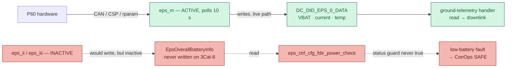

# 8. System-Level Findings

Three current gaps, each visible only by following the system's data paths end to end rather than inspecting any one component in isolation. None is a build defect; two bear on flight safety and one on ground visibility, and two of them compound. All three are confirmed against the committed source and carry their reasoning and candidate fixes.

---

## 8.1 The automatic low-battery safing does not fire (safety)

The fault meant to transition the satellite to a safe mode on low battery reads its voltage from the `EpsOverallBatteryInfo` DataCache entry — which only the **inactive** `eps_ii` / `eps_iii` drivers would populate. The **active** driver, `eps_m`, writes battery voltage to a different entry (`DC_DID_EPS_0_DATA`). So `eps_ctrl_cfg_fdir_power_check()` never sees an `OK` status, its guard is never satisfied, and the low-battery → SAFE transition never executes on the satellite as built.

The fault is **owned correctly** (by `eps_ctrl`); the mechanism is simply not wired to the active driver's telemetry — an inherited structural gap. Two candidate fixes are identified, none chosen: have `eps_m` also populate `EpsOverallBatteryInfo` (minimal, reuses the existing check as-is), or make the check EPS-M-aware and read `DC_DID_EPS_0_DATA`. Pending a systems decision.

## 8.2 The project's own services are not monitored by the task supervisor (safety)

`taskmon` — the supervisor that would detect and recover a permanently hung task — registers only vendor/SDK tasks. Confirmed from `taskmon_id.inc`: of the five running non-vendor services (`eps_m`, `ttc`, `pl_payloads`, `hs_comms`, `pl_deployments`), **none** is registered; each instead calls `drv_iwdg_refresh()` directly, which the supervisor already does unconditionally, so it confers no protection. A permanent hang in any of them would go undetected while the OBC appeared healthy. (`pl_gnss_ro` is a sixth such service in source but is not registered with the payload controller, so it never runs.) The split is exactly along authorship lines, and the SDK never documents the registration as a requirement — so this is a robustness gap, not a convention violation.

The most consequential instances are `pl_deployments` (a hang mid-sequence is deployment-timing-relevant) and `eps_m` (a hang silently stops all battery telemetry — which compounds with §8.1, since that telemetry is the only remaining visibility into battery state).

> **The obvious fix carries a trap.** `pl_deployments` sleeps through the post-launch inhibit hold, which is far longer than the supervisor's ten-minute check window, and the canonical registration pattern checks in *after* the sleep. Registering it the ordinary way would make the supervisor issue a reset during that safety-critical hold. Any fix must handle long-sleeping tasks explicitly. Pending a whole-codebase policy decision.

## 8.3 The beacons carry no health telemetry (mission)

The beacon service transmits on its period, but every NVM telemetry preset — for all three operating modes — is left at its unconfigured default (`INVALID_BEACON_SLOT_ASSIGNMENT`, confirmed across the mode presets). So each beacon is a header only: a heartbeat and mode indicator with no battery, temperature, or subsystem state. This is not a code defect — the presets are operator-configured during commissioning — but the required pre-launch configuration step is documented nowhere, so omitting it would be silent.

Candidate fixes, none chosen: document preset configuration as a mandatory pre-launch checklist item (and define the intended content per mode), or change the NVM defaults so a sensible minimum health set ships pre-configured — the latter deserves serious consideration on the principle that the default state should be the safe one.

## 8.4 Why this matters — the combination (safety)

**§8.1 and §8.3 compound.** In a battery-depletion scenario the condition would be **neither detected automatically on board** (the safing is inert) **nor visible in the downlink** (the beacon carries no battery state) — leaving only the retrieval of stored files during a ground pass, which itself assumes a still-healthy satellite. Neither finding is alarming alone; the overlap is the single most important item to raise with the systems team.

---

## 8.5 The flight-critical configuration item

Separate from the three findings, and the most urgent item overall: the deployment-inhibit delay `PL_DEPLOY_MIN_POSTLAUNCH_DELAY_MS` is `0U` for ground testing — and at zero the hold is skipped entirely. The in-source flight target is **1,800,000 ms (30 minutes)** (the code carries `TODO: set to 1800000U for flight`). It must be confirmed against the launch-provider mandate and set before any flight build. This is a safety and regulatory requirement, not an implementation detail.
